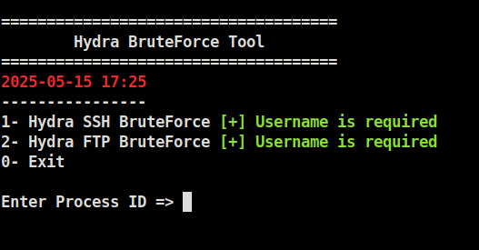
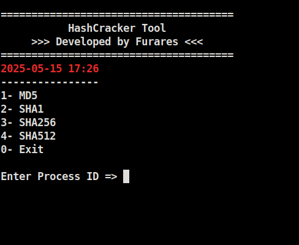
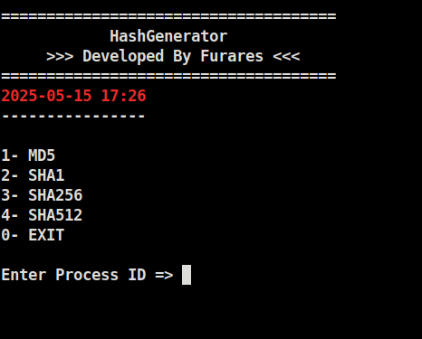

# 🔐 CTF-Toolkit

CTF-Toolkit is a toolkit designed for Capture The Flag (CTF) competitions and security testing. It integrates populer tools like **Nmap**, **Gobuster**, **Metasploit**, **Bettercap**, **Wireshark** and **Hydra**

## 🔒 Security Warning

>>CTF-Toolkit is for ethical and authorized security testing only. Any unauthorized use may lead to legal consequences. The author is not responsible for any damage or misuse. Always obtain explicit permission before testing any system.

---

### Banner Created With:
-This ASCII banner was created using the [**ASCII Art Generator**](https://www.asciiart.eu/text-to-ascii-art) website.

---
## 🚀 Features
- 🔍 **Nmap**: Performs network scanning and vulnerability analysis.
- 🌐 **Gobuster**: Used for directory and file enumeration in web applications.
- 🔑 **Hashing**: Generate and crack hashes using various cryptographic algorithms.
- 🧪 **Metasploit**: Exploit target systems and test vulnerabilities.
- 🧰 **HashGenerator**: A custom tool to generate hashes using algorithms like `MD5`, `SHA-1`, `SHA-256`, `SHA-512`
- 🔓 **HashCracker**: A custom tool to crack hashes using brute-force or dictionary-based methods. `MD5`, `SHA-1`, `SHA-256`, `SHA-512`
- 🌍 **MACAddressChanger**: A custom utility to change your MAC address for anonymity or testing purposes.
- ⚙️ **Automation**: Combines these tools and automates processes to speed up testing.

---
## 📂 Installation

### Requirements
**Nmap** | **Gobuster** | **Metasploit** | **Hydra** | **John** | **ssh2john** | **Wireshark** | **Bettercap**
>[Required Python Libraries](requirements.txt)


### Installation Steps

```bash
git clone https://github.com/furares/ctf-toolkit.git
cd ctf-toolkit
pip install -r requirements.txt
```
---

## 🧠 Usage

```bash
sudo python3 main.py
```
<!DOCTYPE html>
<html lang="en">
<head>
  <meta charset="UTF-8">
  <title>My Vehicle Terminal Screens</title>
  <style>
    body {
      background-color: #111;
      display: flex;
      justify-content: center;
      align-items: center;
      height: 100vh;
      margin: 0;
      color: white;
      font-family: sans-serif;
    }
    .slideshow-container {
      position: relative;
      max-width: 800px;
    }
    .mySlides {
      display: none;
      width: 100%;
    }
    img {
      width: 100%;
      height: auto;
      border-radius: 8px;
    }
  </style>
</head>
<body>

<div class="slideshow-container">
  <div class="mySlides"></div>
  <div class="mySlides"></div>
  <div class="mySlides"></div>
  <div class="mySlides"></div>
</div>

<script>
  let slideIndex = 0;
  showSlides();

  function showSlides() {
    let slides = document.getElementsByClassName("mySlides");
    for (let i = 0; i < slides.length; i++) {
      slides[i].style.display = "none";
    }
    slideIndex++;
    if (slideIndex > slides.length) { slideIndex = 1; }
    slides[slideIndex - 1].style.display = "block";
    setTimeout(showSlides, 3000);
  }
</script>

</body>
</html>


---

### ⚠️ Important Notice 
Some tools require certain dependencies to be pre-installed on your system. Please ensure that the necessary tools are already installed before using them. 🛠️

### 👁️ Nmap Scan Results
The results of your Nmap scans will be stored in the `nmap_results/` directory. 📂

### 🔑 RSA Key Cracking
The `ssh2john.py` script required for cracking RSA keys should be located in the current directory. 📂

### 🖥️ MAC Address Changer
The MAC Address Changer tool was created by me. Please note that it may not always work perfectly on all systems, as it has been tested mainly on Linux Mint and Kali Linux. 🛠️

Use it with caution, and ensure you're on a supported system for the best results! ⚠️

### 📂 Wordlists
If you'd like, you can move your wordlists into the `wordlists/` directory for better organization. 📋


### 🔥 Check Out My TryHackMe Profile
> **[TryHackMe Profile](https://tryhackme.com/p/furares)** 👾


